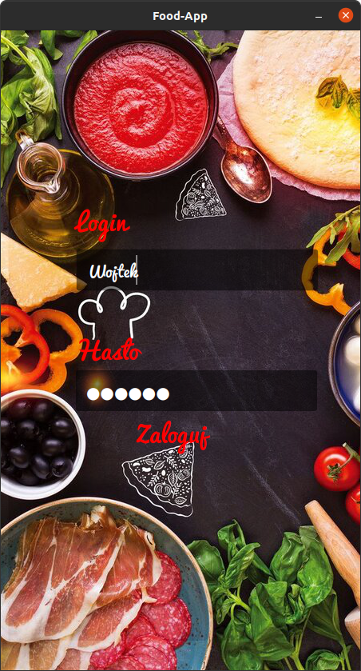
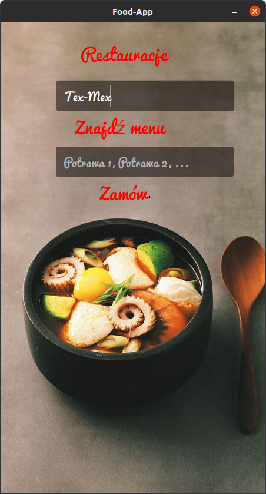
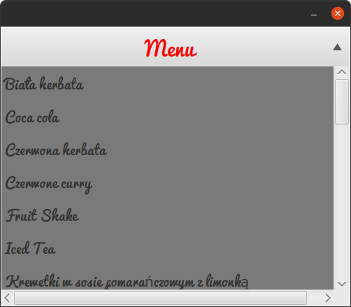

# Food-App Project Overview
## Description
Food-App is a GUI application used for connecting to
database created specially for BD course.  
In order to connect, one has to enter valid user login and correct password.
After that, one will be automatically connected to server containing
database with relevant information in it.

## How to run the application
In order to run application one has to download and install 
**gradle**. After successful installation of **gradle** and downloading this repository
one has to type in the terminal following command:  
`./gradlew run`  
After that the application should launch without any problems.

## How to use
In order to see menu of any restaurant, user has to enter the name 
of the restaurant (**NOTE** restaurant must be present in the database).
After specifying the name of the restaurant press button with option 
*Znajdź menu*.  
To make an order, enter the names of meals into relevant 
text field (**NOTE** Meals have to belong to the same restaurant).
After that press button with text *Zamów* and receive your 
order number.

## Application look
Below one can see screenshots showing the GUI 
of the Food-App.

###Logging Page

###Main Menu

###List of dishes
 

